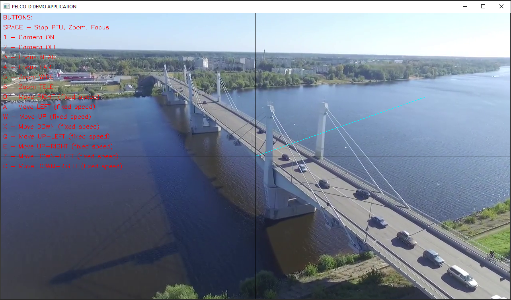

***
## OVERVIEW

The **Pelco-D Protocol Parser library** is designed to help developers control cameras and pan-tilt platforms using the Pelco-D protocol. The library has a simple interface and only does message encoding. The library includes a single class **PelcoDProtocolParser**. The interface of the programming class is shown below:
```c++
/**
 * @brief Pelco-D protocol parser class.
 */
class PelcoDProtocolParser
{
public:
    /**
     * @brief Class constructor.
     */
    PelcoDProtocolParser();
    /**
     * @brief Class destructor.
     */
    ~PelcoDProtocolParser();
    /**
     * @brief Method to encode Pelco-D command (Always 7 bytes).
     * 
     * @param packet Pointer to packet buffer. Always 7 bytes.
     * @param address Camera address (usually 1).
     * @param command_ID ID of command.
     * @param data_1 First byte of command data (according to Pelco-D specification).
     * @param data_2 Second byte of command data (according to Pelco-D specification).
     * @return true If the command has been encoded.
     * @return false In case any errors.
     */
    bool GetCommand(
        uint8_t* packet,
        uint8_t address,
        pelco::PelcoDCommands command_ID,
        uint8_t data_1 = 0,
        uint8_t data_2 = 0);
};
```
The command IDs are described in the **PelcoDCommands** structure in the **PelcoDProtocolParser.h** file. The field names of the structure correspond to the Pelco-D protocol specification. The The declaration of the structure is as follows.
```c++
enum class PelcoDCommands
{
    // Main commands.
    CAMERA_ON,
    CAMERA_OFF,
    IRIS_CLOSE,
    IRIS_OPEN,
    FOCUS_NEAR,
    FOCUS_FAR,
    FOCUS_STOP,
    ZOOM_WIDE,
    ZOOM_TELE,
    ZOOM_STOP,
    DOWN,
    UP,
    LEFT,
    RIGHT,
    UP_RIGHT,
    UP_LEFT,
    DOWN_RIGHT,
    DOWN_LEFT,
    STOP,
    // Extended commands.
    SET_PRESET,
    CLEAR_PRESET,
    GO_TO_PRESET,
    FLIP_180DEG_ABOUT,
    GO_TO_ZERO_PAN,
    SET_AUXILIARY,
    CLEAR_AUXILIARY,
    REMOTE_RESET,
    SET_ZONE_START,
    SET_ZONE_END,
    WRITE_CHAR_TO_SCREEN,
    CLEAR_SCREEN,
    ALARM_ACKNOWLEDGE,
    ZONE_SCAN_ON,
    ZONE_SCAN_OFF,
    SET_PATTERN_START,
    SET_PATTERN_STOP,
    RUN_PATTERN,
    SET_ZOOM_SPEED,
    SET_FOCUS_SPEED,
    RESET_CAMERA_TO_DEFAULT,
    AUTO_FOCUS_AUTO_ON_OFF,
    AUTO_IRIS_AUTO_ON_OFF,
    AGC_AUTO_ON_OFF,
    BACKLIGHT_COMPENSATION_ON_OFF,
    AUTO_WHITE_BALANCE_ON_OFF,
    ENABLE_DEVICE_PHASE_DELAY_MODE,
    SET_SHUTTER_SPEED,
    ADJUST_LINE_LOCK_PHASE_DELAY,
    ADJUST_WHITE_BALANCE_R_B,
    ADJUST_WHITE_BALANCE_M_G,
    ADJUST_GAIN,
    ADJUST_AUTO_IRIS_LEVEL,
    ADJUST_AUTO_IRIS_PEACK_VALUE,
    QUERY
};
```
***
## EXAMPLE COMMAND ENCODING
Below is an example of the platform stop command and an example of the zoom in command.
```c++
// Init variables.
uint8_t packet[7];
uint8_t camera_address = 1;
// STOP camera and PTU.
if (pelco_protocol_parser.GetCommand(packet, camera_address, pelco::PelcoDCommands::STOP))
{
    // Send command.
    tcp_port.SendData(packet, 7);
    serial_port.SendData(packet, 7);
}
// Zoom tele.
if (pelco_protocol_parser.GetCommand(packet, camera_address, pelco::PelcoDCommands::ZOOM_TELE))
{
    // Send command.
    tcp_port.SendData(packet, 7);
    serial_port.SendData(packet, 7);
}
```
***
## DEMO APPLICATION
Folder **Pelco_D_ProtocolParser -> PelcoDProtocolParserTests** contains the demo application files (**PelcoDDemoApplication**). The application reads the **PelcoDemoApplication.json** parameter file after start-up, which contains video source parameters and connection parameters to the camera or pan-tilt platform. The application can control the camera or pan-tilt platform via a serial port or TCP connection. The contents of the configuration file are shown below.
```json
{
    "Video_Source_Params":
    {
        "video_source_init_string":"0"
    },

    "Communication_Params":
    {
        "camera_IP":"127.0.0.1",
        "TCP_port":5600,
        "serial_port_name":"/dev/tty0",
        "serial_port_baudrate":115200,
        "camera_address":1,
        "max_PTU_speed":63
    }
}
```
The application can capture video from a video file (for example: **video_source_init_string: "test.mp4"**), can capture RTP video stream (for example: **video_source_init_string: "rtp://xxx.xxx.xxx.xxx:1234"**) or can capture video from WEB camera (for example: **video_source_init_string: "0"**). The **Communication_Params** section contains the parameters for the connection to the camera or pan-tilt platform. If you want to control via a TCP connection, you must set the correct TCP port (**TCP_Port** field) and device IP address (**Camera_IP** field) in the config file. If TCP connection is not required then set field **TCP_port** value to **-1**. To control via the serial port you need to set the serial port name (**serial_port_name** field) and baudrate (**serial_port_baudrate** field). The **camera_address** field defines the name of the camera or platform to be controlled via the Pelco-D protocol. The **max_PTU_speed** field defines the maximum pan-tilt platform speed (according to Pelco-D protocol the maximum speed can be not more then **63**). Once the demo application has been started and the parameters initialised, the software shows the video in a separate window. The application uses the **OpenCV** library to capture and display video. To compile the demo application you must specify path to OpenCV lib in you OS. The user interface of demo application is shown below.



The user interface consists of a video display window with superimposed information: a line from the centre of the video to the position of the mouse pointer and hints for the programme control buttons. The user can control the camera rotation using the mouse. To do this, left-click at any position in the video window. Depending on the position of the mouse pointer, a rotation command will be generated with the desired speed (at the edge of the video the speed will be maximum, and in the centre the speed will be minimum, according to **max_PTU_speed** field in config file). The user can also control the camera using the keyboard buttons:
    **1** - Camera ON
    **2** - Camera OFF
    **3** - Focus NEAR
    **4** - Focus FAR
    **5** - Zoom WIDE
    **6** - Zoom TELE
    **D** - Move RIGHT (fixed speed)
    **A** - Move LEFT (fixed speed)
    **W** - Move UP (fixed speed)
    **X** - Move DOWN (fixed speed)
    **Q** - Move UP-LEFT (fixed speed)
    **E** - Move UP-RIGHT (fixed speed)
    **Z** - Move DOWN-LEFT (fixed speed)
    **C** - Move DOWN-RIGHT (fixed speed)


